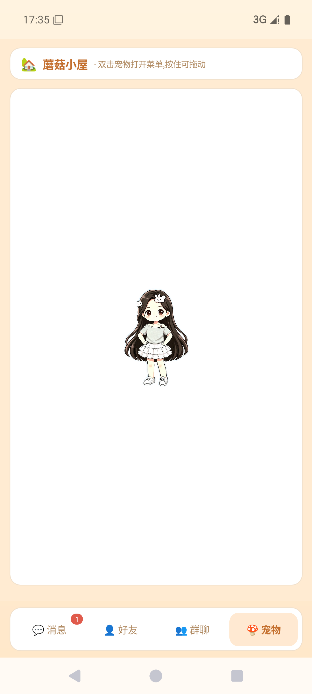
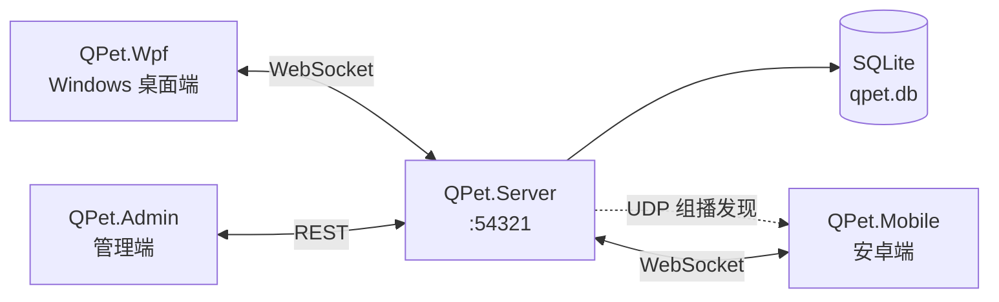
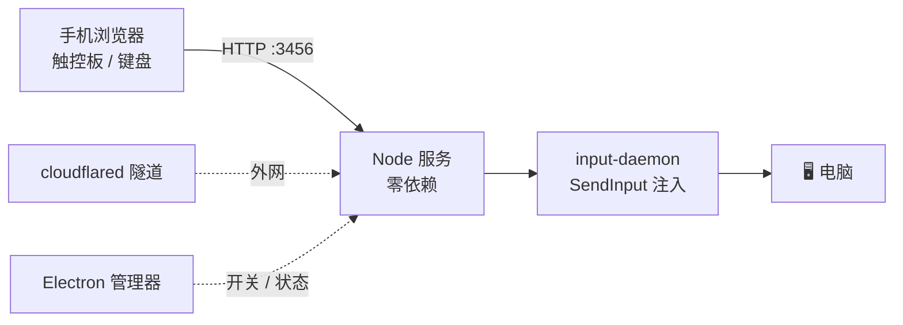

<div align="center">

# cat

**两个自托管的小项目 —— 一个桌宠聊天室，一个把手机变成键鼠的工具**

[](https://dotnet.microsoft.com/)
[](https://nodejs.org/)
[](https://www.electronjs.org/)


</div>

## 📦 仓库内容

| 目录 | 项目 | 一句话 |
| :--- | :--- | :--- |
| [`depe/`](depe/) | **Q版桌宠** | 自托管的桌宠 + 即时通讯：服务端、Windows 桌面端、安卓端、管理端 |
| [`inkm/`](inkm/) | **智能键鼠** | 把手机变成电脑的键盘 / 鼠标 / 触控板，局域网 + 外网双通道 |
| [`inno/`](inno/) | 打包脚本 | 智能键鼠的 Inno Setup 安装包配置 |

两个项目彼此独立，各跑各的，没有共享代码。

---

## 🐾 Q版桌宠

一只住在你桌面和手机上的宠物，顺带把聊天也做了。全自托管 —— 服务端跑在自己的电脑上，消息不经过任何第三方。

<div align="center">
  
</div>

**功能**

- 🐣 **桌宠** —— 走动、眨眼、睡觉、被拖动，待在桌面或悬浮窗里；点击有回应，尺寸多端同步
- 💬 **聊天** —— 私聊与群聊、已读回执、未读红点
- 👥 **好友** —— 搜索、申请、审批、备注、删除
- 🏘️ **群组** —— 创建 / 搜索 / 加入 / 邀请 / 审批，群主与管理员、移出成员、解散
- 🔍 **零配置联机** —— 局域网 UDP 组播自动发现服务器，不用手输 IP
- 🛠️ **管理端** —— 独立的管理窗口，账号与群组管理

**架构**



**技术栈**

| 组件 | 技术 |
| :--- | :--- |
| `QPet.Server` | .NET 10 控制台 · Kestrel（WebSocket + 管理 REST）· Microsoft.Data.Sqlite |
| `QPet.Wpf` | WPF · net10.0-windows |
| `QPet.Mobile` | .NET MAUI · net10.0-android（API 21+）· 前台服务悬浮窗 |
| `QPet.Admin` | WPF · net10.0-windows |

**跑起来**

```bash
# 1. 启动服务端（会打印 IP、端口与管理密码）
dotnet run --project depe/QPet.Server
#    可选参数：--db <路径>  --port <端口>  --admin-password <密码>

# 2. 启动 Windows 桌面端
dotnet run --project depe/QPet.Wpf

# 3. 启动管理端
dotnet run --project depe/QPet.Admin

# 4. 打包安卓端（需安装 maui-android workload 与 Android SDK）
dotnet publish depe/QPet.Mobile -f net10.0-android -c Release
```

客户端登录界面填服务端打印的地址即可；同一局域网内会自动发现。安卓端首次使用需在系统设置里授予「显示在其他应用上层」权限，桌宠才能悬浮。

---

## 📱 智能键鼠

躺在沙发上，用手机操作电脑。手机浏览器打开一个网页就能当触控板、键盘和鼠标用 —— 电脑端不用装任何客户端。

**功能**

- 🖱️ **触控板** —— 移动 / 轻触点击 / 双指滚动，灵敏度可调
- ⌨️ **键盘** —— 直接输入，另有方向键、Tab、Enter、Esc 等按键
- ✅ **弹窗审批** —— 一键把方向键 + 回车组合成「允许 / 拒绝」序列，远程处理电脑上的确认弹窗
- 📋 **剪贴板** —— 与电脑互通
- 🌐 **双通道** —— 局域网直连；出门在外走 Cloudflare 隧道，自动重连与退避
- 🪟 **桌面管理器** —— Electron 窗口，一键开关服务、查看连接二维码与隧道地址

**架构**



**技术栈**

| 组件 | 技术 |
| :--- | :--- |
| `server/` | Node.js，零运行时依赖 · 内置 http 服务 · 端口 3456 |
| `server/bin/input-daemon.cpp` | C++ 输入守护进程（源码在库，需自行编译） |
| `desktop/` | Electron 35 桌面管理器 |
| `inno/install.iss` | Inno Setup 打包配置（卸载时调用 `quit.exe` 收尾） |

**跑起来**

```bash
# 启动服务，手机浏览器访问 http://<电脑IP>:3456
npm start

# 打开 Electron 管理窗口（首次需先装依赖）
cd desktop && npm install && cd ..
npm run desktop

# 外网通道（需 bin/cloudflared.exe）
npm run tunnel:connect
```

**依赖三个未入库的二进制**（见下方说明），需要自己准备：

| 文件 | 用途 | 获取方式 |
| :--- | :--- | :--- |
| `inkm/server/bin/node.exe` | 便携版 Node 运行时 | [nodejs.org](https://nodejs.org/) 下载后放入 |
| `inkm/server/bin/cloudflared.exe` | 外网隧道 | [Cloudflare 官方发布页](https://github.com/cloudflare/cloudflared/releases) |
| `inkm/server/bin/input-daemon.exe` | 输入注入 | 用 MSVC 编译同目录的 `input-daemon.cpp`：<br/>`cl /EHsc /O2 /MT input-daemon.cpp /link user32.lib gdi32.lib` |

---

## 🗂️ 目录结构

```
cat/
├── depe/                        # Q版桌宠（.NET 10）
│   ├── QPet.Server/             #   服务端：WebSocket + REST + SQLite
│   ├── QPet.Wpf/                #   Windows 桌面端（WPF）
│   ├── QPet.Mobile/             #   安卓端（MAUI）
│   ├── QPet.Admin/              #   管理端（WPF）
│   └── QPet.Server/data/qpet.db #   SQLite 数据库（未入库）
├── inkm/                        # 智能键鼠
│   ├── server/                  #   Node 服务 + 输入守护
│   ├── desktop/                 #   Electron 管理器
│   └── data/                    #   运行时临时文件（未入库）
└── inno/install.iss             # Inno Setup 打包脚本
```

## ⚠️ 关于仓库体积

构建产物与体积大的二进制**不在版本控制内**（`.gitignore` 已排除），因此克隆后需要自己准备：

- **Q版桌宠**：四个项目各自 `dotnet run` / `dotnet build` 即可，无额外二进制，安卓端的 APK 需自行构建
- **智能键鼠**：上表中列出的 `node.exe`、`cloudflared.exe` 与输入守护进程

未入库的典型文件包括 `node_modules/`、`bin/`、`obj/`、各端 APK/AAB、`inno/*.exe` 安装包（119 MB）与内嵌运行时 —— 它们都可以由源码重新生成或从官方渠道下载。

例外：`inkm/server/bin/input-daemon.cpp`（源码）与 `inkm/quit.exe`、`inkm/智能键鼠.exe`（小于 10 KB 的配套工具）已入库。
